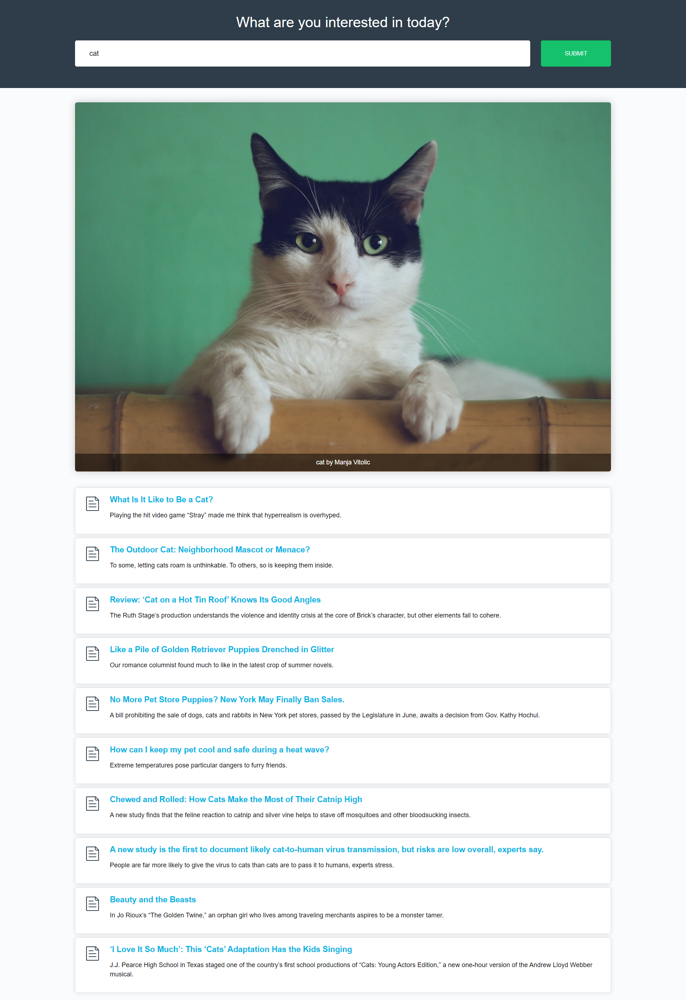

# Ajax

- This rebo is feching two APIs from 'unsblash' an 'nytimes' and return one photo from unsblash and some articles from nyt based on user search.
- The app is making asynchronous requests using three different methods:
  - the XHR object
  - jQuery's `.ajax()` method
  - the Fetch API
- The starting code and structure is from [Udacity's Ajax course]()

The same project is built with each of these techniques. You'll find one folder for each.

**Note:** i'm just adding a copy of one of the HTML files in the root for the sake of deploying the page on github.

### Screenshot

### Links

- Live Site URL: [click here](https://ibrahim11elian.github.io/image-and-articles/)

### Built with

- Semantic HTML5 markup
- CSS custom properties
- Flexbox
- javscript
- ES6
- jQuery
- ajax
- XHR
- Fetch API

## Author

- Frontend Mentor - [@ibrahim11elian](https://www.frontendmentor.io/profile/ibrahim11elian)
- Facebook : [@ibrahim11ahmed](https://www.facebook.com/ibrahim11ahmed/)
- Linkedin : [@ibrahim-ahmed-a8bba9196](https://www.linkedin.com/in/ibrahim-ahmed-a8bba9196/)
